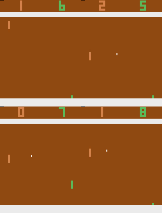

The Atari Game Q-Learning project in Reinforcement Learning involves training an agent to play classic Atari games by learning optimal actions to maximize score. The agent explores various game states and updates its Q-values through interactions, improving its performance over time. This project demonstrates the effectiveness of Q-Learning in complex environments with high-dimensional state spaces, often using techniques like experience replay and function approximation to handle large state-action pairs.

